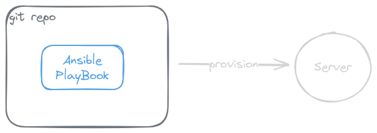

# Wordpress IaC (Infrastructure as code)

<p align="center">
    
</p>

This repository contains an idempotent Ansible playbook for automating the installation of WordPress, a private Docker registry, a database, a backup script, and hardening.

## Roles
- [x] Essentials
- [x] Swap
- [x] Docker
- [x] Traefik
- [x] Registry
- [x] WordPress
- [x] Backup
- [x] Reboot

## Setup
```
python3 -m venv venv
source venv/bin/activate
pip install -r requirements.txt
```

## Run
Add ssh config host name to `hosts`
```
ansible-playbook setup.yml
```

## Defaults
```
Swap: 2G
Traefik: auth
MySQL: namings
Backup
registry
```

## Links
```
https://registry-wp.arsalanse.ir
https://traefik-wp.arsalanse.ir
https://staging-wp.arsalanse.ir
```

## License

This project is licensed under the MIT License. See the LICENSE file for details.
